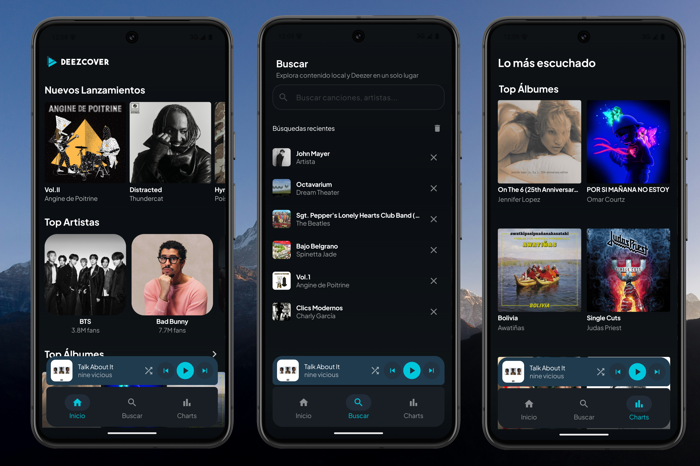

# Deezcover

<p align="center">
  
</p>

An Android music app that demonstrates **offline-first architecture** using the **Deezer** public API.

---

## Preview

<p align="center">
  
</p>

---

## 🏗 Architecture

Clean Architecture with a clear separation of concerns:

* **UI** — Jetpack Compose
* **ViewModel** — StateFlow + UiState
* **Repository** — Single source of truth, offline-first logic
* **Local** — Room + Flow
* **Remote** — Retrofit + Deezer API

---

## 🔄 Offline-First Flow

```
Room emits local data immediately
      ↓
UI displays data (no internet required)
      ↓
API syncs in background
      ↓
Room updates → UI reacts automatically
```

---

## 🚀 Features

* 🎵 Real music data from Deezer Chart API
* 📦 Full offline support (no internet required)
* 🔍 Search by title or artist
* 🔄 Pull to refresh
* 📡 Live connectivity status
* 🖼️ Album artwork with Coil
* 🎯 Song detail screen with Deezer link

---

## 🧰 Tech Stack

| Layer      | Technology               |
| ---------- | ------------------------ |
| UI         | Jetpack Compose          |
| State      | StateFlow / UiState      |
| DI         | Hilt                     |
| Local DB   | Room                     |
| Networking | Retrofit + Gson          |
| Images     | Coil                     |
| Navigation | Navigation Compose       |
| Testing    | JUnit4 + Mockk + Turbine |

---

## 📁 Project Structure

```
com.mauro.deezcover/
├── data/
│   ├── local/        # Room (DB, DAO, Entities)
│   ├── remote/       # Retrofit + DTOs
│   ├── repository/   # Offline-first implementation
│   ├── mapper/       # Data ↔ Domain mapping
│   ├── network/      # Connectivity handling
│   └── player/       # Media3 / ExoPlayer integration
├── domain/
│   ├── model/        # Core business models
│   ├── repository/   # Contracts (interfaces)
│   └── usecase/      # Business logic
├── presentation/
│   ├── home/         # Home screen (charts, releases)
│   ├── search/       # Search + history
│   ├── albumdetail/  # Album details
│   ├── artistdetail/ # Artist details
│   ├── player/       # Player UI & state
│   ├── components/   # Reusable UI components
│   └── navigation/   # NavGraph & routes
├── ui/
│   └── theme/        # Design system
├── di/               # Hilt modules
├── MainActivity.kt   # Entry point
└── DeezcoverApp.kt   # Application class
```


---

## 🧪 Tests

* `SongMapperTest` — mapping validation
* `SongRepositoryImplTest` — offline-first flow
* `HomeViewModelTest` — UI state handling

---

## 🌐 API

This app uses the **Deezer API** (no authentication required):

```
GET https://api.deezer.com/chart/0/tracks
```

---

## 📌 Status

* ✅ Production-ready
* ✅ Clean Architecture
* ✅ Offline-first fully implemented

---

## 👨‍💻 Author

**Mauro Cosentino**

* GitHub: https://github.com/maurocosentino

